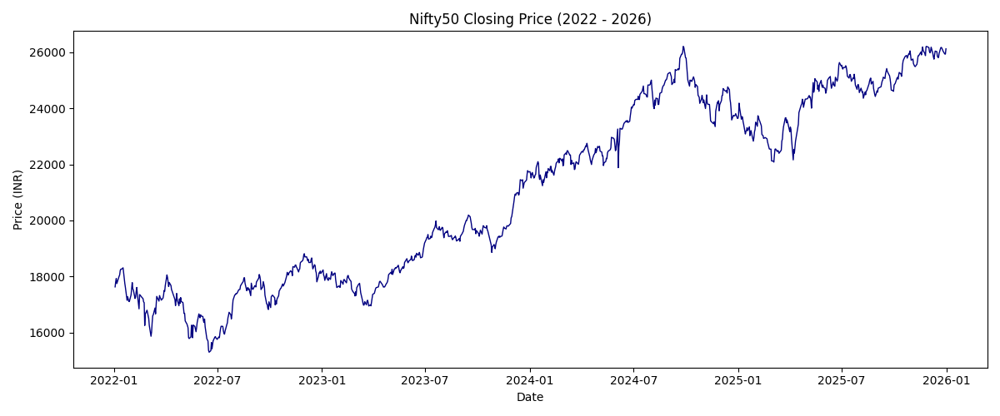
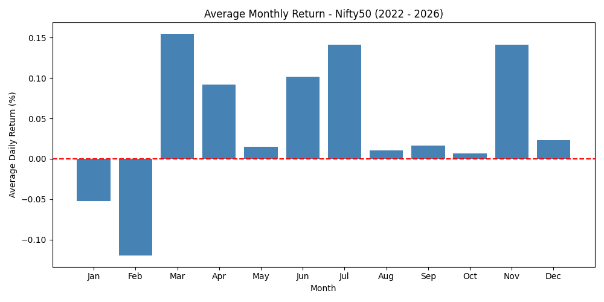
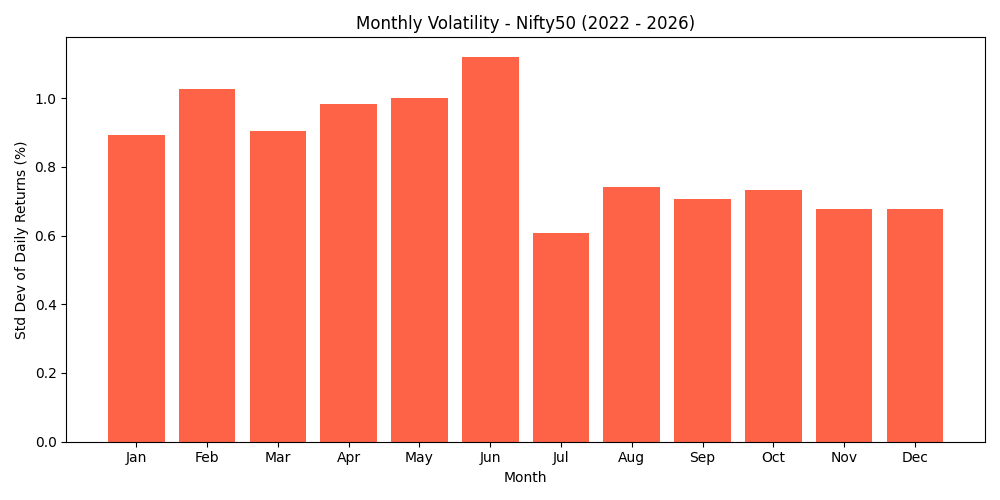
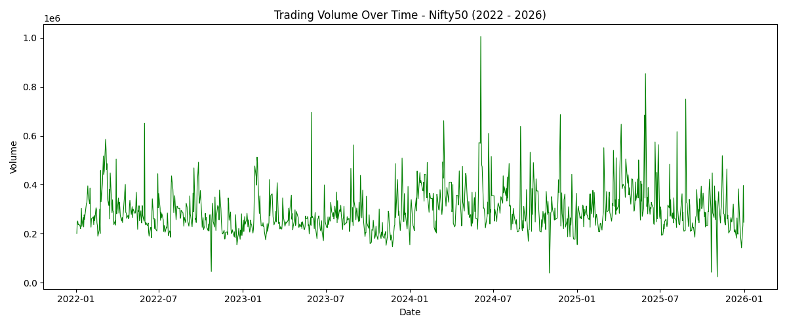
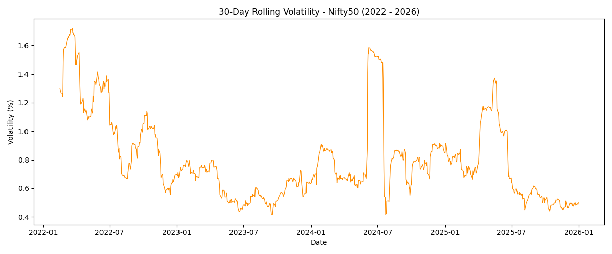

# Nifty50 Market Analysis (2022-2026)

## Overview
This project analyzes 4 years of Nifty50 index data to identify 
patterns in returns, volatility, and trading volume using Python.
The goal was to understand how macroeconomic events and seasonal 
patterns affect Indian equity markets. Tools used: pandas for data 
cleaning, matplotlib for visualization, and yfinance to obtain 
historical data.

## Data Source
Data was obtained using the yfinance Python library.
- Index: Nifty50 (^NSEI)
- Period: January 2022 to January 2026
- Columns: Date, Close, High, Low, Open, Volume
- Frequency: Daily trading data (988 rows after cleaning)

## Methodology
1. Loaded raw CSV with corrected column headers
2. Converted Date column to datetime format and sorted chronologically
3. Replaced 8 zero Volume values with NaN and applied forward fill
4. Calculated daily returns using percentage change on Close price
5. Performed monthly aggregation for return and volatility analysis
6. Computed 30-day rolling volatility to track risk over time

## Visualizations

### 1. Nifty50 Closing Price (2022-2026)

Nifty50 grew from ~15,200 in mid-2022 to ~26,000 by 2026, 
reflecting a long-term bull market interrupted by two major 
shock events.

### 2. Average Monthly Return

January and February show the only negative average daily 
returns across the dataset, indicating consistent seasonal 
weakness at the start of the calendar year.

### 3. Monthly Volatility

June shows the highest monthly volatility while July shows 
the lowest, suggesting mid-year uncertainty followed by 
market stabilization.

### 4. Trading Volume Over Time

Volume remained relatively stable throughout 2022-2026 with 
occasional spikes, confirming that major price movements were 
not always accompanied by unusually high trading activity.

### 5. 30-Day Rolling Volatility

Two clear volatility regimes are visible — the 2022 geopolitical 
shock and the 2024 election spike — with relative calm in between.

## Key Findings

Finding 1 — Geopolitical Shock (Early 2022):
Nifty50 experienced its sharpest volatility spike in the dataset 
during early 2022, coinciding with the Russia-Ukraine conflict. 
Foreign institutional investors withdrew capital from emerging 
markets including India, driving prices to the dataset's lowest 
levels (~15,200) and daily volatility above 1.6%.

Finding 2 — Election Uncertainty (Mid-2024):
A sharp volatility spike occurred in mid-2024 following Indian 
general election results. Markets had priced in a stronger mandate 
for the ruling party. The unexpected outcome triggered panic 
selling, producing one of the largest single-period volatility 
spikes in the 4-year window despite a long-term upward price trend.

Finding 3 — Seasonal Weakness (January-February):
January and February consistently showed negative average daily 
returns across the dataset, with above-average volatility. This 
suggests a recurring seasonal pattern of weakness in the first two 
months of the year in Indian markets, possibly linked to global 
portfolio rebalancing at the start of the calendar year.

Finding 4 — Elevated Post-2024 Risk:
After mid-2024, despite a price recovery and bull run, rolling 
volatility remained elevated and spiked again in early 2025. 
This indicates that rising prices did not mean falling risk — 
a important distinction for any risk-aware investor.

## Limitations
- Analysis covers index-level data only; no sectoral breakdown
- The 4-year window captures only 2 major shock events, which 
  limits the generalizability of seasonal findings
- Events were identified manually by visual inspection, not through 
  a formal statistical event detection method
- Volume data had 8 missing values that were forward-filled, 
  which may slightly affect volume-related conclusions

## How to Run
pip install pandas matplotlib yfinance
python data_cleaning.py
python AN.py
python viz.py

## Author
Yashraj Patil
BSc Biotechnology, KTHM College, Nashik
